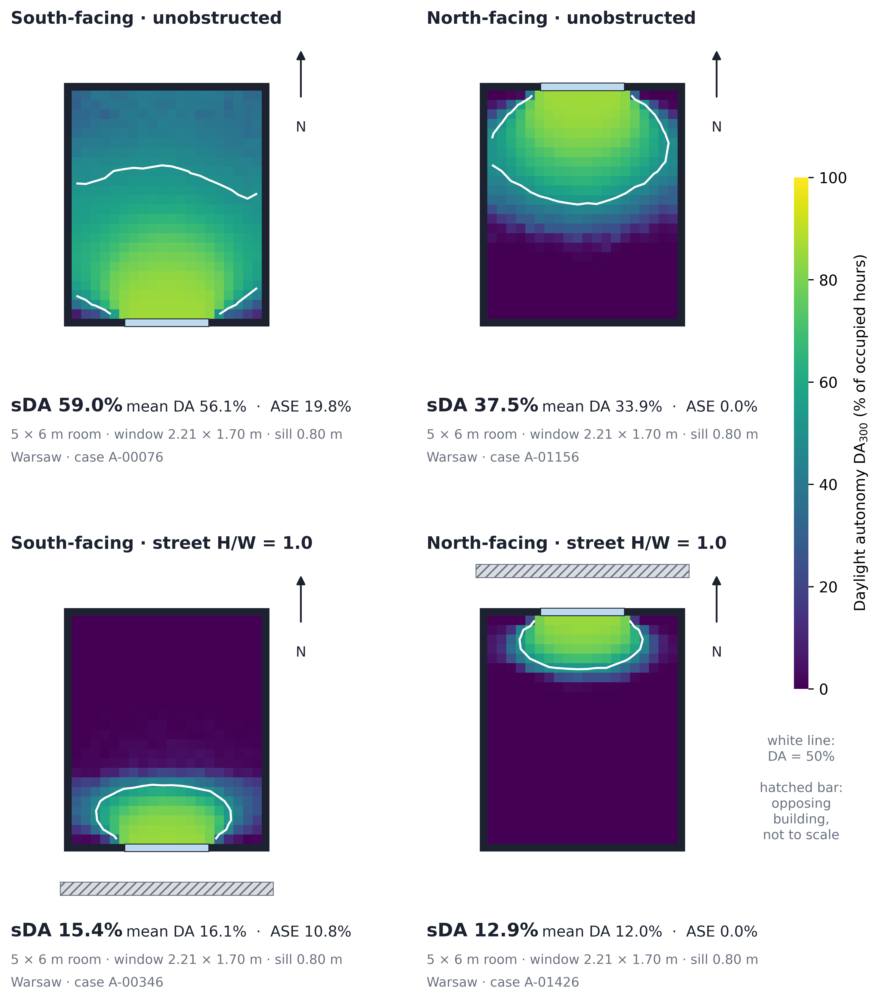
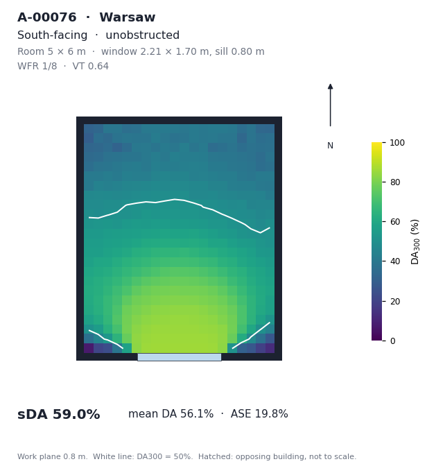

<div align="center">

# Parametric Daylight Room Study 2026

[](LICENSE)
[](LICENSE-DATA)

</div>

Dataset and code for a study of the **1/8 window-to-floor ratio (WFR)** rule under climate-based daylight modelling. The study covers **7,200 single-side-lit residential room configurations** in Warsaw and Berlin, simulated in three batches, plus a convergence check of the Radiance parameters.

The 1/8 rule appears in the Polish *Warunki techniczne* and the German *Musterbauordnung*. Every configuration in the baseline batch complies with it exactly. The dataset records what that compliance delivers in terms of spatial daylight autonomy (sDA<sub>300/50%</sub>) and annual sunlight exposure (ASE<sub>1000,250</sub>), as room geometry, window position, facade orientation and street canyon density vary.

> **Status:** the associated manuscript is under peer review. Citation metadata will be added once the review process concludes.
>
> **Corrections:** this version replaces the dataset released with the original submission. See [CORRECTION.md](CORRECTION.md) for what changed and why.


*Daylight autonomy DA<sub>300</sub> in one room (5.0 × 6.0 m, Warsaw), facing south and north, unobstructed and at H/W = 1.0. The white line marks DA<sub>300</sub> = 50%; the area inside it is counted in sDA<sub>300/50%</sub>.*

---

## Contents

```
.
├── README.md
├── CORRECTION.md                 what changed since the original submission
├── LICENSE                       code: MIT
├── LICENSE-DATA                  data and figures: CC BY 4.0
├── requirements.txt
├── study/
│   ├── A-baseline.xlsx           Batch A, 4,320 configurations
│   ├── B-sill-control.xlsx       Batch B,   720 configurations
│   ├── C-wfr-x-vt.xlsx           Batch C, 2,160 configurations
│   ├── D-ab-sweep.xlsx           convergence check, 48 simulations
│   └── da-grids/                 one image per configuration (generated, see below)
│       ├── A/  A-00000.png … A-04319.png
│       ├── B/  B-00000.png … B-00719.png
│       └── C/  C-00000.png … C-02159.png
├── scripts/
│   ├── common.py                 shared loaders, constants and metric functions
│   ├── check_metrics.py          recomputes every stored metric from the per-sensor arrays
│   └── render_da_grids.py        renders the 7,200 daylight autonomy images
├── figures/
│   ├── make_all_figures.py       regenerates every manuscript figure
│   ├── fig03_room_plans.py … fig16_17_aperture_vertical.py
│   ├── graphical_abstract.py
│   └── output/                   Figure_03.png/.pdf … Figure_17.png/.pdf
└── docs/                         images used in this README
```

---

## Quick start

All scripts are run from the repository root.

```bash
pip install -r requirements.txt

python scripts/check_metrics.py        # verify every stored metric (about 1 min)
python figures/make_all_figures.py     # regenerate Figures 3 to 17 (about 1 min)
python scripts/render_da_grids.py      # render all 7,200 images (see below)
```

### Rendering the daylight autonomy images

`render_da_grids.py` draws one image per configuration into `study/da-grids/<batch>/<case_id>.png`: the room in plan with north up, the window, the opposing building when the street is obstructed, the DA<sub>300</sub> = 50% line, and the parameters and metrics of the case.



The script runs in chunks on several processes and can be stopped and restarted at any time: images that already exist are skipped. It renders about 10 images per second per core, so the full set takes roughly 12 minutes on one core and a few minutes on a multi-core machine.

```bash
python scripts/render_da_grids.py                          # all three batches
python scripts/render_da_grids.py --batches A              # one batch
python scripts/render_da_grids.py --batches C --start 0 --stop 500
python scripts/render_da_grids.py --cases A-00076 A-01156  # specific cases
python scripts/render_da_grids.py --workers 4 --chunk 500 --dpi 100
python scripts/render_da_grids.py --overwrite              # re-render existing images
```

The complete set is about 330 MB. It can be generated with the script, or downloaded as `da-grids.zip` from the Releases page of this repository.

---

## Study design

| File | Batch | Configurations | Climate | Purpose |
|---|---|---|---|---|
| `A-baseline.xlsx` | A | 4,320 | Warsaw, Berlin | Full factorial at the prescribed 1/8 ratio |
| `B-sill-control.xlsx` | B | 720 | Berlin | Separates window clear height from sill position |
| `C-wfr-x-vt.xlsx` | C | 2,160 | Warsaw | Window-to-floor ratio × glazing transmittance; vertical sensor planes at eye height |
| `D-ab-sweep.xlsx` | D | 48 | Warsaw | Convergence check of the ambient bounce setting (`-ab 3`, `5`, `8`) |

### Parameters

| Parameter | Batch A | Batch B | Batch C |
|---|---|---|---|
| Room width (m) | 3.0 to 7.0, step 0.5 (9) | 3.0, 5.0, 7.0 | 3.0, 5.0, 7.0 |
| Room depth (m) | 3 to 7, step 1 (5) | 3 to 7 | 3 to 7 |
| Window clear height (m) | 1.4, 1.7, 2.0 | 1.4, 1.7, 2.0 | 1.7 |
| Sill height (m) | 0.80 for 1.4 and 1.7; 0.67 for 2.0 | 0.67 for all | 0.80 |
| Orientation | South, East, North, West | same | same |
| Street aspect ratio H/W | 0.0, 0.5, 1.0, 1.5 | same | same |
| Window-to-floor ratio | 1/8 | 1/8 | 1/8, 1/6, 1/5 |
| Glazing VT | 0.64 | 0.64 | 0.64, 0.70, 0.76 |
| Climate | Warsaw, Berlin | Berlin | Warsaw |

**Window clear height** is measured from sill to head. Because the glazing area is fixed by the ratio, the clear height also fixes the window width (glazing area / clear height). In Batch A the sill was lowered to 0.67 m for the 2.0 m clear height, because a 0.80 m sill would place the window head above the ceiling. Batch B repeats all three clear heights at the same 0.67 m sill, which separates the two effects. No configuration in any batch has a window wider than the facade or a head above the ceiling.

**Fixed in all batches:** floor-to-ceiling height 2.70 m; window centred on the exterior wall and recessed 0.15 m; street width 15 m, with the opposing building height set to reach the target H/W (0, 7.5, 15.0 and 22.5 m); room at ground-floor level; reflectances ceiling 0.8, wall 0.5, floor 0.2, ground 0.1, facade 0.2.

---

## Data dictionary

One row per configuration, sheet `Arkusz1`. All metrics are in percent (0 to 100).

### Shared columns

| Column | Description |
|---|---|
| `case_id` | Unique ID, e.g. `A-00076`. Matches the image file name in `study/da-grids/`. |
| `iteration`, `iteration_name`, `datetime` | Solver run index, encoded parameter combination and timestamp. |
| `Location` | `Warsaw` or `Berlin` (Batch A only; Batches B and C use one climate, see `epw_file`). |
| `width`, `depth` | Room width along the window wall and room depth, in m. |
| `win_height` | Window clear height, sill to head, in m. |
| `sill_h` | Sill height above floor, in m. |
| `window_area` | Glazed area, in m². Equals `width × depth × WFR`. |
| `rotation` | Orientation **index**: `0` South, `1` East, `2` North, `3` West. The model rotates counter-clockwise. |
| `urban canyon toggle` | Street aspect ratio **index**: `0` H/W 0.0 (unobstructed), `1` 0.5, `2` 1.0, `3` 1.5. |
| `VT`, `WFR` | Glazing visible transmittance and window-to-floor ratio. |
| `epw_file` | Climate file used for the run. |

### Batches A and B

| Column | Description |
|---|---|
| `sDA` | sDA<sub>300/50%</sub> over the full floor area. **Reported in the manuscript.** |
| `ASE_results` | ASE<sub>1000,250</sub> over the full floor area. **Reported in the manuscript.** |
| `culled_sDA`, `ASE_culled_results` | The same metrics with a 0.5 m perimeter band removed. Sensitivity analysis only. |
| `raw_DA`, `culled_raw_DA` | Per-sensor DA<sub>300</sub>, `;`-delimited. |
| `raw_ASE_hours`, `raw_culled_ASE_hours` | Per-sensor hours above 1,000 lux of direct sun, `;`-delimited. |

### Batch C

| Column | Description |
|---|---|
| `ratio` | Denominator of the window-to-floor ratio: `8`, `6` or `5`. |
| `sDA-horizontal`, `ASE_results-horizontal` | Metrics on the work plane at 0.8 m. |
| `raw_DA-horizontal`, `raw_ASE_hours-horizontal` | Per-sensor values on the work plane. |
| `sDA_vert_south_facing`, `sDA_vert_north_facing` | The sDA criterion (DA<sub>300</sub> ≥ 50%) applied to vertical sensors at 1.2 m facing south and north. |
| `raw_DA_vert_*`, `raw_ASE_hours_vert_*`, `ASE_vert_*` | Per-sensor and plane-level values for the vertical planes. |

Both vertical planes face south and north in every configuration, whatever the facade orientation. In south- and north-facing rooms they are therefore the planes facing towards and away from the window; the manuscript restricts the vertical analysis to these 1,080 configurations.

### Batch D (convergence check)

Sixteen Batch A configurations, each simulated with `-ab 3`, `-ab 5` and `-ab 8`. Columns follow Batches A and B, plus `batch_a_case_id` (the Batch A configuration), `ab` (3, 5 or 8), `radiance_parameters` and `mean_DA` (mean DA<sub>300</sub> over the full grid). Compare values **within** Batch D only. It is a separate simulation run: the `-ab 5` results reproduce Batch A sDA within 0.6 percentage points, but ASE in south-facing configurations differs from Batch A by up to 4.7 points (north-facing configurations match exactly). Within Batch D, ASE is identical at all three settings.

---

## Metric conventions

- **sDA<sub>300/50%</sub>:** share of sensors with DA<sub>300</sub> **≥ 50%** of occupied hours.
- **ASE<sub>1000,250</sub>:** share of sensors receiving more than 1,000 lux of direct sun for **more than 250 hours**.
- **Analysis area:** the full regularly occupied floor area, as defined in ANSI/IES LM-83-23. The culled variants (0.5 m band removed) are provided for sensitivity analysis.
- **Sensor grid:** work plane at 0.8 m, spacing 0.25 m, `(width / 0.25) × (depth / 0.25)` sensors.
- **Sensor order** in the `;`-delimited horizontal arrays is width-major: index `k = i × n_depth + j`, with `i` along the window wall and `j` from the window wall (`j = 0`) to the back wall. `scripts/common.py` provides `grid()` to reshape an array.
- The per-sensor order of the **vertical** arrays in Batch C has not been verified against the horizontal grid. Plane-level metrics do not depend on it; spatial maps of the vertical planes should not be drawn from these arrays without checking.

`python scripts/check_metrics.py` recomputes every stored metric from the per-sensor arrays and reports any difference.

---

## Simulation setup

| Item | Setting |
|---|---|
| Modelling environment | Rhinoceros 3D / Grasshopper, iterated with Colibri |
| Simulation toolset | Ladybug Tools 1.10.0 (Ladybug + Honeybee) |
| Recipe | `annual-daylight-enhanced` (enhanced two-phase method) |
| Diffuse component | Daylight coefficients, Tregenza subdivision (145 sky patches + 1 ground patch, `gendaymtx -m 1`), Perez All-Weather sky, `-ab 5 -ad 5000 -lw 2e-05` |
| Direct solar component | Rays traced from each sensor to the hourly sun position, without interreflection. ASE is computed from this component. |
| Climate files | EnergyPlus EPW: Warsaw-Okęcie (123750), Berlin (103840) |
| Evaluation window | 08:00 to 18:00, per ANSI/IES LM-83-23 |
| Shading | None. No dynamic blinds or occupant behaviour model. |

Because no blind operation is modelled, sDA describes the bare performance of the room and street geometry. It is an upper bound relative to occupied conditions, where blinds would be used in response to direct sun.

---

## Scope and limitations

- Single-side-lit rectangular rooms with one centred window; no corner units, multi-aspect dwellings or multiple windows.
- Opposing buildings are continuous uniform extrusions, and the room is at ground-floor level. Real streets are porous, and upper floors see more sky.
- Street aspect ratio is sampled at 0.0, 0.5, 1.0 and 1.5 only.
- Two climates at the same latitude.
- Interior reflectances are fixed. Glazing transmittance is varied only in Batch C.
- Eye-height values are photopic illuminance, not melanopic equivalent daylight illuminance.

## Licence

Code is MIT ([LICENSE](LICENSE)). Data, figures and documentation are CC BY 4.0 ([LICENSE-DATA](LICENSE-DATA)). Attribution is required for both.

## Acknowledgements

Simulation uses [Radiance](https://www.radiance-online.org/) through [Ladybug Tools](https://www.ladybug.tools/) in [Grasshopper](https://www.grasshopper3d.com/).

## Citation

*Citation and DOI to be added on acceptance.*
